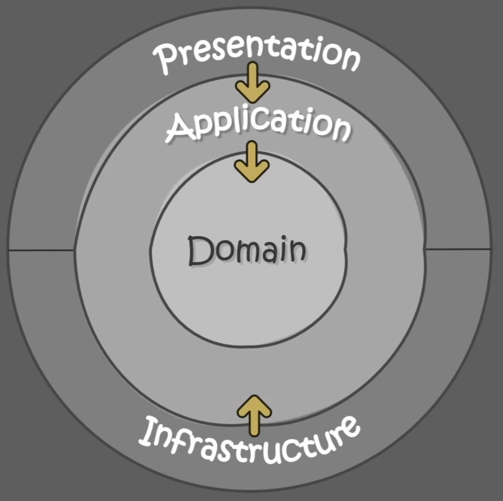

# Clean Architecture Practice

A Project for learning how to architecture right using ASP.NET Core Web API.
The project is based on a youtube course, [ASP.NET Core 8 Web API in Clean architecture from scratch](https://www.youtube.com/watch?v=E6sUJWwZLwE&ab_channel=FullstackDev).
This only covers basic and does not seem completely accurate. For more advanced course, check out the official resource, [Clean Architecture With .NET 6 And CQRS - Project Setup](https://www.youtube.com/watch?v=tLk4pZZtiDY&list=PLYpjLpq5ZDGstQ5afRz-34o_0dexr1RGa&ab_channel=MilanJovanovi%C4%87) and etc. 

## Course Agenda
1. REST Web API
- HTTP : Protocol that sets out(defines) the rules for exchanging information on computer devices in the WWW network. (Plain text, stateless, cacheable)
- HTTP Verbs: GET, POST, PUT, PATCH, DELETE
- https/(protocol)/youtube.com(domain)/results(path)?search_query=webapi(query parameters)
- Communication between the server and the client :
    [1] Client => (HTTP Verb, Request Headers, Request Body) => Server\
    [2] Client <= (Status Code, Response Header, Response Body) <= Server
- API(Application Programming Interface) : Set of rules (definitions and protocols) that enable one app/system to communicate and cooperate with other.
- REST(Representational State Transfer) : Stateless(No session required. Already contains all necessary info), Cacheable(Reuse, Improved Performance), Layered System(Independent Modules that can change without affecting others), Uniformed Interface(Consistent), Content Negotiation(Allows clients to specify prefered data format), HATEOAS(Hypermedia As The Engine Of Application State, ??)
[Good Resource explaining what REST API is](https://wonit.tistory.com/454)
- Set up local environment
- Create a web API project
- Routing & Model Binding
2. Solution Architecture
- What is clean architecture
    [▶ Simple/Better Explanation](https://www.youtube.com/watch?v=TQdLgzVk2T8&ab_channel=MilanJovanovi%C4%87)
    = SOLID & Separation of concerns
    = Benefits: Testability, UI independence, Free to choose/change the database, Flexibility, Transparency

    - Domain/Entity/Core Module: Business Logics
    - Application Module: Application Logics
    - Presentation Module: Web API Interface
    - Infrastructure Module: Connect to Database, Cloud
3. Infrastructure Setup
- Entity Framework => ORM (Code first)
    - DbContext = Database Instance
    - DbSet = Table
    - DbContext
        => Microsoft.EntityFrameworkCore
    - Migration
        => Microsoft.EntityFrameworkCore.Tools
    - MS SQLServer
        => Microsoft.EntityFrameworkCore.SqlServer
    - ETC
        => SSMS(Microsoft SQL Server Management Studio)
- LINQ
- Database Connection
- Executing Migrations
4. API Controller
- Retrieving entities with HTTP GET endpoints
- Mapping Entities to DTOs
- Model Validation
- Creating Resources
5. CQRS + MediatR
- Command/Query (Responsibility segregation)
- MediatR Package
6. WEB API Utilities
- Add logger
- Generate Documentation
- Handle Exceptions
7. Sub-entities
- How to adapt infrastructure to match REST API Guidelines
- Such as Creating, Fetching, or Removing Sub-entities.
8. Authentication
- Set up Infrastructure for User & Role Definition in the Database
- Identity Package
9. Authorization
- Different approaches for User Authorization
- Role based, Attribute based, and Resource based
10. Pagination
- Improve Performance by Introducing:
- Filtering, Sorting, and Paging
11. Automated Tests
- Unit and Integration tests for crucial logics and features
12. Azure Cloud
- Deploy the API Solution to Azure Using...
- App Service Plan, Web App Resource, Azure SQL Instance, Blob Storage, and Application Insights
- Two Different Azure Environments (Dev, Prod)

13. CI/CD Pipelines
- CI/CD Integration
- Git Branch Policies